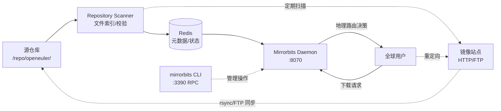

# Mirrorbits — Claude Code 项目入口

> 项目级 CLAUDE.md。**AI agent / 新加入的人，先读这一份就够动手了**。每段都是要么直接给答案、要么给到具体下一份要读的文档。

---

## 0. 1 分钟读懂

**一句话**：Mirrorbits（`mirrorbits`）—— 用 Go 编写的地理智能下载重定向器，为大规模开源项目提供高效的文件分发服务（CDN 层）

**给谁用**：
- **开源社区运营者**：需要为全球用户分发大型文件（ISO 镜像、软件包等）的开源项目（如 openEuler、VideoLAN、LineageOS）
- **使用场景**：用户下载 openEuler ISO 时，自动重定向到距离最近、负载最轻的镜像站点；自动监控镜像健康度并剔除失效节点

**核心价值**：
- **解决什么**：在全球多个镜像站点间智能路由下载请求，基于地理位置、AS 号、镜像负载和健康度实时决策，提供类 CDN 的分发能力
- **不解决**什么（边界）：不负责文件托管本身、不做源站存储、不处理镜像站点的内部同步逻辑（镜像站自己通过 rsync/FTP 从源同步）

---

## 1. 架构与技术栈

### 1.1 系统视图



**关键流程**：
1. **索引阶段**：定期扫描本地源仓库，收集文件列表、校验和、大小，存入 Redis
2. **同步监控**：定期探测各镜像站点，检查文件可用性和健康度
3. **请求路由**：用户请求到达 → 查询 GeoIP 定位 → 综合考虑地理距离、镜像负载、健康度 → 返回最优镜像 URL（JSON 或 HTTP 302）

### 1.2 技术栈

| 维度 | 选型 | 备注 |
|---|---|---|
| 语言 | Go 1.20+ | 版本要求见 go.mod |
| 框架 | 标准库 net/http + graceful | 单二进制，无重型框架 |
| 持久层 | Redis 3.2+ | 存储文件元数据、镜像状态、统计数据；**必须开启持久化** |
| 地理定位 | GeoIP2 (MaxMind mmdb) | 用于 IP → 国家/大陆/AS 号映射 |
| 同步协议 | rsync / FTP | 用于探测镜像站点文件可用性 |
| 部署 | systemd / Docker / K8s | 支持零停机升级（seamless binary upgrade） |
| 监控 | 内置统计 API | `?mirrorstats` / `?mirrorlist` 端点 |

### 1.3 与其它项目的关系

- **上游（数据源）**：本地源仓库（如 `/repo/openeuler/sha`），由其他系统负责从上游同步
- **下游（消费方）**：全球镜像站点（通过 rsync/FTP 从源同步）；终端用户（通过 HTTP 下载）
- **同级依赖**：
  - Redis（状态存储）
  - GeoIP2 数据库（地理定位）
  - 镜像站点网络（外部合作方提供）

---

## 2. 仓结构 & 命名

### 2.1 仓本身

```
mirrorbits/
├── main.go              ← 程序入口
├── cli/                 ← CLI 命令实现
├── daemon/              ← HTTP 服务器 + 主逻辑
├── core/                ← 核心逻辑（扫描、版本、上下文）
├── database/            ← Redis 操作封装
├── http/                ← HTTP 处理器
├── mirrors/             ← 镜像管理逻辑
├── scan/                ← 文件扫描 + 镜像同步检测
├── network/             ← 网络工具（AS 号、地理距离计算）
├── rpc/                 ← CLI ↔ Daemon 通信（gRPC）
├── filesystem/          ← 文件系统 I/O
├── logs/                ← 日志封装
├── utils/               ← 工具函数
├── templates/           ← HTML 模板（mirrorlist 页面）
├── config/              ← 配置解析
├── GeoIP/               ← GeoIP2 数据库存放位置
├── contrib/             ← 第三方集成（Docker、systemd、GeoIP 更新脚本）
├── testing/             ← 测试工具
├── scripts/             ← 辅助脚本
├── mirrorbits.conf      ← 配置文件示例
├── Makefile             ← 构建脚本
└── Dockerfile           ← Docker 镜像构建
```

### 2.2 命名约定

- **文件**：`snake_case.go`（Go 标准）
- **分支**：`feature/<description>` / `fix/<issue-id>-<slug>`
- **commit**：`<type>: <subject>`，类型：`feat` / `fix` / `refactor` / `docs` / `test`
- **变量/函数**：Go 标准（驼峰命名，导出用大写开头）

---

## 3. 5 分钟跑通本地

```bash
# 0. 前置条件：Go 1.20+, Redis 3.2+, GeoIP2 数据库
# 检查 Go 版本
go version  # 期望 >= 1.20

# 1. 安装依赖
go mod download

# 2. 启动 Redis（如果未运行）
# 方式 A：Docker
docker run -d --name redis -p 6379:6379 redis:7-alpine redis-server --appendonly yes

# 方式 B：本地 Redis
# redis-server --appendonly yes

# 3. 下载 GeoIP2 数据库（首次需要）
mkdir -p GeoIP
# 从 MaxMind 下载 GeoLite2-City.mmdb 和 GeoLite2-ASN.mmdb 到 GeoIP/ 目录
# 或使用 contrib/geoip/ 下的脚本自动下载

# 4. 准备配置文件
cp mirrorbits.conf mirrorbits-dev.conf
# 编辑 mirrorbits-dev.conf：
#   - Repository: 改为本地测试目录（如 /tmp/test-repo）
#   - RedisAddress: localhost:6379
#   - ListenAddress: :8080
#   - GeoipDatabasePath: ./GeoIP

# 5. 构建
make build
# 或直接运行开发版（带 race 检测）
make dev

# 6. 创建测试仓库
mkdir -p /tmp/test-repo
echo "test file" > /tmp/test-repo/test.txt

# 7. 启动服务
./bin/mirrorbits -config mirrorbits-dev.conf daemon &

# 8. 使用 CLI 添加镜像
./bin/mirrorbits -config mirrorbits-dev.conf add \
  -http="http://mirrors.example.com/openeuler/" \
  mirrors.example

# 9. 启用镜像
./bin/mirrorbits -config mirrorbits-dev.conf enable mirrors.example

# 10. 验证
curl http://localhost:8080/test.txt          # 应返回 JSON 或重定向
curl http://localhost:8080/?mirrorstats      # 查看镜像统计
```

**常见跑不起来**：
- **报错 "Redis connection refused"** → 检查 Redis 是否运行，配置文件中 `RedisAddress` 是否正确
- **报错 "GeoIP database not found"** → 下载 GeoLite2 数据库到 `GeoipDatabasePath` 指定目录
- **404 Not Found** → 检查 `Repository` 路径是否正确，是否已执行仓库扫描（服务启动后会自动扫描）
- **镜像不可用** → 使用 `mirrorbits list` 检查镜像状态，`mirrorbits scan` 手动触发扫描

---

## 4. 项目铁规（违反直接打回，不商量）

- 🔴 **必须**：所有对 Redis 的写操作必须考虑并发安全，使用 WATCH/MULTI/EXEC 或 Lua 脚本保证原子性
- 🔴 **必须**：配置文件中**禁止**硬编码真实的镜像 URL、Redis 密码等敏感信息；示例配置用占位符
- 🔴 **必须**：新增或修改影响路由决策的逻辑时，必须添加单元测试（`_test.go` 文件）
- 🔴 **禁止**：在生产环境直接修改 Redis 中的数据，所有操作走 CLI 命令（保证审计和一致性）
- 🔴 **禁止**：使用 `SELECT *` 风格的全量数据加载；Redis 中数据可能很大，按需 HGET/HMGET
- 🔴 **禁止**：在代码中硬编码文件路径、域名、IP 地址；统一通过配置文件传入
- 🟡 **强烈建议**：新增 HTTP 端点时，考虑添加速率限制（避免滥用）
- 🟡 **强烈建议**：日志中包含 `mirrorID` / `fileHash` 等关键标识符，便于追踪问题

---

## 5. 常见任务怎么做（playbook）

| 我要做的事 | 第一步看哪 | 关键决策点 | 核心文件 |
|---|---|---|---|
| 添加新镜像 | CLI 命令 `mirrorbits add` | HTTP/FTP URL、地理位置、权重 | `cli/add.go` |
| 调整镜像权重 | `mirrorbits edit <mirror>` | 权重影响负载分配比例 | `mirrors/mirrors.go` |
| 修改路由算法 | `daemon/http.go` | 地理距离、AS 号、负载权重的计算逻辑 | `mirrors/selection.go` |
| 添加新配置项 | `config/config.go` | 配置结构体 + YAML 解析 | `mirrorbits.conf` |
| 优化 Redis 查询 | `database/redis.go` | 批量操作、Pipeline、Lua 脚本 | `database/` |
| 新增 HTTP API | `http/http.go` | 路由注册、handler 实现 | `daemon/http.go` |
| 修改扫描逻辑 | `scan/scan.go` | 文件校验、并发控制 | `core/scan.go` |
| 调试镜像选择 | 请求 `?mirrorlist` | 查看候选镜像及评分 | `http/templates.go` |

---

## 6. 踩坑录（前人的血）

### 6.1 GeoIP 数据库必须定期更新

❌ **错**：部署后从不更新 GeoIP2 数据库 → 新 IP 段无法正确定位 → 路由到错误的地理区域 → 用户体验差（跨国下载）

✅ **对**：使用 cron 定期（每月）从 MaxMind 下载最新的 GeoLite2 数据库，或使用 `contrib/geoip/` 下的更新脚本

🤔 **为啥**：IP 地址分配持续变化，旧数据库会导致定位偏差；MaxMind 每月更新数据库

### 6.2 Redis 持久化必须开启

❌ **错**：Redis 使用默认配置（无持久化）→ Redis 重启后所有镜像状态、文件索引丢失 → 服务不可用，需重新扫描（可能数小时）

✅ **对**：启动 Redis 时开启 AOF 或 RDB 持久化：`redis-server --appendonly yes`

🤔 **为啥**：Mirrorbits 的所有状态都在 Redis 中，丢失数据 = 重新建立索引需要大量时间

### 6.3 镜像扫描并发数要根据镜像站容量调整

❌ **错**：`ConcurrentSync: 200` → 同时探测 200 个镜像 → 部分小型镜像站被打爆、触发封禁 → 镜像不可用

✅ **对**：根据镜像站点规模调整 `ConcurrentSync`（建议 10-50），或为每个镜像单独设置扫描频率

🤔 **为啥**：小型镜像站承载能力有限，高并发探测会被误认为攻击

### 6.4 零停机升级需要先替换二进制再发送信号

❌ **错**：先执行 `mirrorbits upgrade` 再替换二进制 → 新进程启动时加载的是旧二进制 → 升级失败

✅ **对**：先替换 `/usr/local/bin/mirrorbits`，然后执行 `mirrorbits upgrade` → 父进程通知子进程热重启

🤔 **为啥**：`upgrade` 命令触发的是信号传递，实际 fork 新进程时才读取磁盘上的二进制文件

---

## 7. AI 自动开发流水线接入

**说明**：本项目尚未接入自动化 AI 开发流水线。如需接入，需要补充：
- `.github/agents/` 目录下的 agent prompt 文件
- 触发词配置
- CI/CD pipeline 集成

相关文档参考上级仓库的流水线架构说明。

---

## 8. 项目术语 / 词汇表

| 术语 | 含义 | 例 |
|---|---|---|
| **Mirror** | 镜像站点 | 一个提供文件下载的 HTTP/FTP 服务器 |
| **Repository** | 源仓库 | 本地主仓库，所有镜像从这里同步 | `/repo/openeuler/sha` |
| **Scan** | 扫描 | 探测镜像站点文件可用性和健康度的过程 | `ScanInterval: 10` (分钟) |
| **Fallback** | 降级镜像 | 当主决策系统不可用时使用的备用镜像 | 配置中的 `Fallbacks` |
| **AS / ASN** | 自治系统号 | ISP 网络标识符，用于判断网络接近度 | AS4134 = 中国电信 |
| **Mirrorlist** | 镜像列表 | 为某个文件返回的所有可用镜像 + 评分 | `?mirrorlist` 端点 |
| **Seamless Upgrade** | 零停机升级 | 不中断服务的二进制热更新机制 | `mirrorbits upgrade` 命令 |
| **GeoIP** | 地理定位 | 根据 IP 地址判断用户地理位置 | MaxMind GeoIP2 数据库 |

---

## 9. 谁负责什么（owners）

| 范围 | 主负责 | 备份 / 群 |
|---|---|---|
| 整体架构 + 维护 | `@opensourceways` 组织 | GitHub Issues |
| 上游项目（原作者） | `@etix` (VideoLAN) | IRC #VideoLAN @ Freenode |
| openEuler 定制版 | `@yao-xiaobai`（当前 fork） | — |
| 生产部署（openEuler） | openEuler 基础设施团队 | — |

**注**：本项目是 fork 自 [etix/mirrorbits](https://github.com/etix/mirrorbits)，针对 openEuler 进行了配置定制。

---

## 10. 这一份太长了 → 我只想 30 秒看完

- **这是什么**：见 §0「一句话」— 地理智能下载重定向器，为开源项目提供 CDN 层
- **铁规**：见 §4 红色项（禁止硬编码敏感信息、禁止直接改 Redis、必须开启持久化）
- **我要动手做某件事**：见 §5 playbook 表，找到任务类型 → 对应文件
- **快速启动**：见 §3（需要 Go 1.20+、Redis、GeoIP2 数据库）
- **更详尽**：见 §11 索引

---

## 11. 往深处读（索引）

| 想了解什么 | 文档 |
|---|---|
| 完整功能列表 | [`README.md`](README.md) |
| 配置文件说明 | [`mirrorbits.conf`](mirrorbits.conf) |
| 构建 + 安装 | [`Makefile`](Makefile) |
| Docker 部署 | [Wiki - Running within Docker](https://github.com/opensourceways/mirrorbits/wiki/Running-within-Docker) |
| 升级指南 | [Wiki - Upgrade Guide](https://github.com/opensourceways/mirrorbits/wiki/Upgrade-Guide) |
| API 端点 | `http/http.go` + `daemon/http.go` |
| 镜像选择算法 | `mirrors/selection.go` |
| Redis 数据结构 | `database/redis.go` |
| 协议定义（RPC） | `rpc/rpc.proto` |
| 变更日志 | [`CHANGELOG.md`](CHANGELOG.md) |

---

## 12. 维护这份文档

- **更新触发点**：
  - 添加新配置项 → 更新 §1.2 技术栈、§5 playbook
  - 修改核心逻辑 → 更新 §1.1 系统视图
  - 遇到新坑 → 补充 §6 踩坑录
  - 重大架构变更 → 更新 §0 和 §1
- **owner**：`@yao-xiaobai` + 你（如果你是 agent，改代码时顺手更新这份）
- **质量自检**：新人第一次部署时如果遇到问题，解决后**回头补充到 §3 或 §6**，让下个人少踩坑
